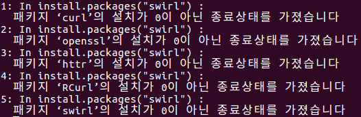

### 바이오메디컬 데이터 사이언스 01

**Getting Started 부터 CLT in Practice 까지.**

### 시작하기 전에...

R을 설치하고, R-Stdio를 설치하고, Hello World를 띄워보기.

- R을 설치하는 방법

	- 링크를 눌러서, 자신의 PC운영체제에 맞는 설치 도구를 다운로드 받아서 설치.

	- [Cran Nexr](http://cran.nexr.com), [서울대 보건대학원](http://healthstat.snu.ac.kr/CRAN/), [UNIST Genome Inst.](http://cran.biodisk.org)

	- 우분투 : sudo apt-get install r-base

- R 스튜디오 설치 

	- R 스튜디오는 [이 링크](https://www.rstudio.com/products/rstudio/download3/)에 들어가서 가장 왼쪽에 있는 파란 버튼을 눌러서 다운로드하여 적절한 지시에 따라 설치.

	- 강제로 설치할 필요는 없지만, R을 사용하기에 더 편함

- 주피터 노트북 설치

	- 주피터 노트북을 이용하면 [깃허브](github.com)와 같은 사이트에서 바로 읽을 수 있음.

	- 설치방법

		- 파이썬 설치 : Python.org 에 접속하여 파이썬 3.5.1 을 다운로드하여 설치 (필히 설치 첫번째에서 PATH에 추가를 체크)

		- 미니콘다 설치 : miniconda 사이트에 접속하여 미니콘다를 다운로드 [Link](http://conda.pydata.org/miniconda.html)

		아나콘다를 사용해도 되지만, 미니콘다를 사용하는 이유는 컴퓨터의 Disk Space를 적게 먹음.

		주피터 노트북만 구동할 것이라면 미니콘다를 깔아도 무방함.

		- 명령 프롬프트나 터미널을 열고 conda install -c r r-essentials 을 입력

		- jupyter notebook 을 입력하면 주피터 노트북이 웹 브라우저 상에 열리고, 맨 오른쪽 상단에 New를 클릭해보면 R이 생성되어 있음.

### Hello World Example.

```{R}
print("Hello World")
```

### Swirl 모듈을 설치해 봅시다

```{R}
install.packages('swirl')
library(swirl)
swirl()
```

예상치 못한 오류 ~~와 자꾸 내 계산기는 안되는거냐~~




