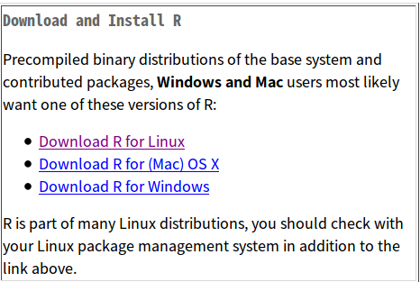

## PH525x Series - Biomedical Data Science

#### PH525x Series - 바이오의학 데이터 과학

**실제 주피터 노트북 파일을 배포하진 않겠습니다, R이 꼬여서 마크다운으로만 배포합니다**

- How To install R? (R을 어떻게 설치하나요?) 

여기서는 윈도우, 리눅스(우분투), 맥의 설치방법에 관하여 이야기할 것입니다.

우선, 밑의 링크를 들어갑시다 (한국 미러 입니다만, 어딜 들어가나 같습니다)

[Cran Nexr](http://cran.nexr.com/), [서울대 보건대학원](http://healthstat.snu.ac.kr/CRAN/), [UNIST Genome Inst.](http://cran.biodisk.org/)



여기에서 각 운영체제에 따라서 윈도우, 리눅스, 맥 을 클릭하여 설치 도구를 다운로드 한 후에, 적절한 지시에 따르면 됩니다.

우분투는 터미널을 여신 후에 이 커맨드 한방이면 설치됩니다

```
sudo apt-get install r-base
R // R을 입력하면 R 커맨드라인 창이 나올 것입니다.
```

- R Studio 설치 (무조건은 아니지만, 정신건강에 이롭습니다)

[여기](https://www.rstudio.com/products/rstudio/download3/)를 클릭하여 접속하면, R스튜디오를 다운로드받아 설치할 수 있는 창이 나옵니다, 맨 왼쪽에 있는 R-Studio 를 클릭하여 다운로드 하시면 됩니다.

- 주피터 노트북에 커널 설치하기
```
// Anaconda 혹은 Miniconda 를 설치하세요
install.packages(c('repr', 'IRdisplay', 'crayon', 'pbdZMQ', 'devtools'))
devtools::install_github('IRkernel/IRkernel')
IRkernel::installspec()  # to register the kernel in the current R installation
```

- Conda install 명령어를 통한 주피터에 커널 추가하는 방법

```
conda install -c r r-essentials
```
### Hello World R! 


```R
print("Hello World!")
```
    // 헬로우 워얼드!가 정상적으로 출력됨.
    [1] "Hello World!"


### help() function을 이용한 도움말 얻기

```{R}
install.packages('swirl') // swirl 패키지를 설치하라는 명령어.
?install.pakcages //앞에 Questionmark(물음표)를 붙여서 할 수도 있고...
help(install.packages)//help() Function 을 이용하여 도움말을 불러오는 방법도 있다
// 따로 코드 실행한 것은 첨부하지 않겠습니다, 너무 길어요(...)
```

### rafalib, downloader 모듈을 설치하고 library() 함수를 이용하여 import 해보기

```{R}
install.packages('rafalib') // rafalib 을 설치합니다
install.packages('downloader') // downloader 을 설치합니다
```

### getwd(), setwd() 함수를 이용하여 Working PATH 를 찾고 설정 해보기

```R
getwd()
```
     [1] "/home/joe" // 홈 디렉토리에 joe라는 폴더에서 시작된다는걸 알 수 있음. 

```R
setwd("당신이 원하는 시작 디렉토리 PATH")
```
### Opt.1 :: Working Dir. 에다가 파일 실습할 파일 다운로드 받아보기.

이 [깃허브 레파지토리](https://github.com/genomicsclass/dagdata/tree/master/inst/extdata)에 접속하여, `FemaleMiceWeights.csv`라는 파일을 다운로드.

아니면 이 깃 자체를 클론해서 사용해도 됨 `git clone 깃허브_주소`와 같이 사용하면 깃 자체를 클로닝 할 수 있음, 일단 git 이 설치되어 있어야 함. 

### 깃 설치방법 / 간단사용방법

- 깃은 리누스 토발즈가 `SVN`에 화가 나서 버전관리 프로그램을 개발하였는데, 그것이 Git이다.

- 일단 깃을 설치하는 방법은.

	- 윈도우: [Git-scm.com](https://git-scm.com/)에 접속하여 Git을 다운로드하여 설치도구의 설명에 따라 설치

	- 리눅스: sudo apt-get install git 을 입력하면 설치됨

- 클로닝 해보기

```
git clone https://github.com/genomicsclass/dagdata/tree/master/inst/extdata // extdata라는 이름의 폴더로 클론될 것임.
```

- 깃 로그 보기

```
git log // 내가 보고싶은 깃의 폴더로 들어가서 저 커맨드를 입력하면 로그를 볼수 있음.
```

- git commit 해보기

```
git add .
git commit -m "커밋 메시지를 입력"
``` 

- 내 저장소에 동기화 해보기

```
git push origin master // 이후에 이메일 / 비밀번호 입력
```

### Clone It! 

```
git clone https://github.com/genomicsclass/dagdata // dagdata 라는 폴더를 만들어져 그 속에 클로닝 될 것임
```


파일이 정상적으로 다운로드 된것을 확인할 수 있음

### Opt.2 :: R에서 파일 다운로드 받아보기 :: 추천

```R
library(downloader) ## 위에서 install.packages()함수를 사용하여 downloader을 설치
url <- "https://raw.githubusercontent.com/genomicsclass/dagdata/master/inst/extdata/femaleMiceWeights.csv"
filename <- "femaleMiceWeights.csv"
download(url, destfile=filename) // 다운로드 함수를 사용하여 다운로드하는데, destifile 옵션에 filename변수의 값과 같도록 설정.
```

### 파일을 읽어봅시다!

```R
dat <- read.csv(filename) //csv 파일을 읽을 수 있도록 하는 함수 read.csv() 함수를 사용하여 파일을 읽어들이기
``` 

### Devtools 설치해보기

~~과연 설치가 될것인가~~ 

```R
install.packages("devtools") 
``` 

**윈도우는** Rtools 를 다운로드받아서 꼭 관리자 권한 으로 열어서 설치하신 후에 저 위의 명령어를 실행하시기 바랍니다! 


