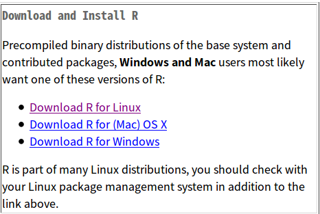
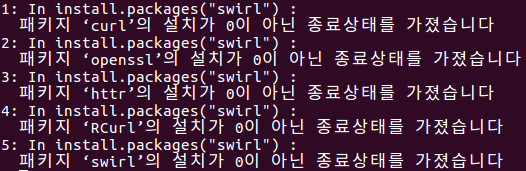

## PH525x Series - Biomedical Data Science

#### PH525x Series - 바이오의학 데이터 과학

**실제 주피터 노트북 파일을 배포하진 않겠습니다, R이 꼬여서 마크다운으로만 배포합니다**

- How To install R? (R을 어떻게 설치하나요?) 

여기서는 윈도우, 리눅스(우분투), 맥의 설치방법에 관하여 이야기할 것입니다.

우선, 밑의 링크를 들어갑시다 (한국 미러 입니다만, 어딜 들어가나 같습니다)

[Cran Nexr](http://cran.nexr.com/), [서울대 보건대학원](http://healthstat.snu.ac.kr/CRAN/), [UNIST Genome Inst.](http://cran.biodisk.org/)



여기에서 각 운영체제에 따라서 윈도우, 리눅스, 맥 을 클릭하여 설치 도구를 다운로드 한 후에, 적절한 지시에 따르면 됩니다.

우분투는 터미널을 여신 후에 이 커맨드 한방이면 설치됩니다

```
sudo apt-get install r-base
R // R을 입력하면 R 커맨드라인 창이 나올 것입니다.
```

- R Studio 설치 (무조건은 아니지만, 정신건강에 이롭습니다)

[여기](https://www.rstudio.com/products/rstudio/download3/)를 클릭하여 접속하면, R스튜디오를 다운로드받아 설치할 수 있는 창이 나옵니다, 맨 왼쪽에 있는 R-Studio 를 클릭하여 다운로드 하시면 됩니다.

- 주피터 노트북에 커널 설치하기
```
// Anaconda 혹은 Miniconda 를 설치하세요
install.packages(c('repr', 'IRdisplay', 'crayon', 'pbdZMQ', 'devtools'))
devtools::install_github('IRkernel/IRkernel')
IRkernel::installspec()  # to register the kernel in the current R installation
```

- Conda install 명령어를 통한 주피터에 커널 추가하는 방법

```
conda install -c r r-essentials
```
### Hello World R! 


```R
print("Hello World!")
```
    // 헬로우 워얼드!가 정상적으로 출력됨.
    [1] "Hello World!"


### help() function을 이용한 도움말 얻기

```{R}
install.packages('swirl') // swirl 패키지를 설치하라는 명령어.
?install.pakcages //앞에 Questionmark(물음표)를 붙여서 할 수도 있고...
help(install.packages)//help() Function 을 이용하여 도움말을 불러오는 방법도 있다
// 따로 코드 실행한 것은 첨부하지 않겠습니다, 너무 길어요(...)
```

### rafalib, downloader 모듈을 설치하고 library() 함수를 이용하여 import 해보기

```{R}
install.packages('rafalib') // rafalib 을 설치합니다
install.packages('downloader') // downloader 을 설치합니다
```

### getwd(), setwd() 함수를 이용하여 Working PATH 를 찾고 설정 해보기

```R
getwd()
```
     [1] "/home/joe" // 홈 디렉토리에 joe라는 폴더에서 시작된다는걸 알 수 있음. 

```R
setwd("당신이 원하는 시작 디렉토리 PATH")
```
### Opt.1 :: Working Dir. 에다가 파일 실습할 파일 다운로드 받아보기.

이 [깃허브 레파지토리](https://github.com/genomicsclass/dagdata/tree/master/inst/extdata)에 접속하여, `FemaleMiceWeights.csv`라는 파일을 다운로드.

아니면 이 깃 자체를 클론해서 사용해도 됨 `git clone 깃허브_주소`와 같이 사용하면 깃 자체를 클로닝 할 수 있음, 일단 git 이 설치되어 있어야 함. 

### 깃 설치방법 / 간단사용방법

- 깃은 리누스 토발즈가 `SVN`에 화가 나서 버전관리 프로그램을 개발하였는데, 그것이 Git이다.

- 일단 깃을 설치하는 방법은.

	- 윈도우: [Git-scm.com](https://git-scm.com/)에 접속하여 Git을 다운로드하여 설치도구의 설명에 따라 설치

	- 리눅스: sudo apt-get install git 을 입력하면 설치됨

- 클로닝 해보기

```
git clone https://github.com/genomicsclass/dagdata/tree/master/inst/extdata // extdata라는 이름의 폴더로 클론될 것임.
```

- 깃 로그 보기

```
git log // 내가 보고싶은 깃의 폴더로 들어가서 저 커맨드를 입력하면 로그를 볼수 있음.
```

- git commit 해보기

```
git add .
git commit -m "커밋 메시지를 입력"
``` 

- 내 저장소에 동기화 해보기

```
git push origin master // 이후에 이메일 / 비밀번호 입력
```

### Clone It! 

```
git clone https://github.com/genomicsclass/dagdata // dagdata 라는 폴더를 만들어져 그 속에 클로닝 될 것임
```



파일이 정상적으로 다운로드 된것을 확인할 수 있음

### Opt.2 :: R에서 파일 다운로드 받아보기 :: 추천

```R
library(downloader) ## 위에서 install.packages()함수를 사용하여 downloader을 설치
url <- "https://raw.githubusercontent.com/genomicsclass/dagdata/master/inst/extdata/femaleMiceWeights.csv"
filename <- "femaleMiceWeights.csv"
download(url, destfile=filename) // 다운로드 함수를 사용하여 다운로드하는데, destifile 옵션에 filename변수의 값과 같도록 설정.
```

### 파일을 읽어봅시다!

```R
dat <- read.csv(filename) //csv 파일을 읽을 수 있도록 하는 함수 read.csv() 함수를 사용하여 파일을 읽어들이기
``` 

### Devtools 설치해보기

~~과연 설치가 될것인가~~ 

```R
install.packages("devtools") 
``` 

**윈도우는** Rtools 를 다운로드받아서 꼭 관리자 권한 으로 열어서 설치하신 후에 저 위의 명령어를 실행하시기 바랍니다! 


### Exercises 01


```R
getwd()
```


'/home/joe/dagdata/inst'


```R
setwd('/home/joe/dagdata/inst/extdata')
```


```R
getwd()
```


'/home/joe/dagdata/inst/extdata'


### CSV 파일을 읽어서 CSV데이터를 출력

femaleMiceWeights.csv 파일을 읽어서 출력해보기


```R
dat <- read.csv('femaleMiceWeights.csv')
```


```R
dat
```


<table>
<thead><tr><th></th><th scope=col>Diet</th><th scope=col>Bodyweight</th></tr></thead>
<tbody>
	<tr><th scope=row>1</th><td>chow </td><td>21.51</td></tr>
	<tr><th scope=row>2</th><td>chow </td><td>28.14</td></tr>
	<tr><th scope=row>3</th><td>chow </td><td>24.04</td></tr>
	<tr><th scope=row>4</th><td>chow </td><td>23.45</td></tr>
	<tr><th scope=row>5</th><td>chow </td><td>23.68</td></tr>
	<tr><th scope=row>6</th><td>chow </td><td>19.79</td></tr>
	<tr><th scope=row>7</th><td>chow</td><td>28.4</td></tr>
	<tr><th scope=row>8</th><td>chow </td><td>20.98</td></tr>
	<tr><th scope=row>9</th><td>chow </td><td>22.51</td></tr>
	<tr><th scope=row>10</th><td>chow</td><td>20.1</td></tr>
	<tr><th scope=row>11</th><td>chow </td><td>26.91</td></tr>
	<tr><th scope=row>12</th><td>chow </td><td>26.25</td></tr>
	<tr><th scope=row>13</th><td>hf   </td><td>25.71</td></tr>
	<tr><th scope=row>14</th><td>hf   </td><td>26.37</td></tr>
	<tr><th scope=row>15</th><td>hf  </td><td>22.8</td></tr>
	<tr><th scope=row>16</th><td>hf   </td><td>25.34</td></tr>
	<tr><th scope=row>17</th><td>hf   </td><td>24.97</td></tr>
	<tr><th scope=row>18</th><td>hf   </td><td>28.14</td></tr>
	<tr><th scope=row>19</th><td>hf   </td><td>29.58</td></tr>
	<tr><th scope=row>20</th><td>hf   </td><td>30.92</td></tr>
	<tr><th scope=row>21</th><td>hf   </td><td>34.02</td></tr>
	<tr><th scope=row>22</th><td>hf  </td><td>21.9</td></tr>
	<tr><th scope=row>23</th><td>hf   </td><td>31.53</td></tr>
	<tr><th scope=row>24</th><td>hf   </td><td>20.73</td></tr>
</tbody>
</table>


### 12번째에 있는 값을 출력해라

처음에는 dat[12]만 썼다가 안되서 찾아봤더니 12번째의 모든 항을 출력할려면 12옆에 [,] 마크를 붙이면 됨.


```R
dat[12,]
```


<table>
<thead><tr><th></th><th scope=col>Diet</th><th scope=col>Bodyweight</th></tr></thead>
<tbody>
	<tr><th scope=row>12</th><td>chow </td><td>26.25</td></tr>
</tbody>
</table>


### 달라심볼을 이용하여 모든 쥐의 몸무게를 출력하고 11번째에 있는 쥐의 몸무게를 출력

You should have learned how to use the `$` character to extract a column from a table and return it as a vector. 

Use `$` to extract the weight column and report the weight of the mouse in the 11th row.


```R
dat$Bodyweight
```


<ol class=list-inline>
	<li>21.51</li>
	<li>28.14</li>
	<li>24.04</li>
	<li>23.45</li>
	<li>23.68</li>
	<li>19.79</li>
	<li>28.4</li>
	<li>20.98</li>
	<li>22.51</li>
	<li>20.1</li>
	<li>26.91</li>
	<li>26.25</li>
	<li>25.71</li>
	<li>26.37</li>
	<li>22.8</li>
	<li>25.34</li>
	<li>24.97</li>
	<li>28.14</li>
	<li>29.58</li>
	<li>30.92</li>
	<li>34.02</li>
	<li>21.9</li>
	<li>31.53</li>
	<li>20.73</li>
</ol>


```R
dat$Bodyweight[11]
## 답은 26.91
```


### length() 함수를 이용하여 여기 있는 모든 쥐의 갯수를 Count 해보기


```R
length(dat$Diet) 
## 답은 24
```

### hf (high fet) 에 있는 쥐들을 출력하고, 그들의 몸무게의 최솟값을 구해보기


```R
library(dplyr) ## library() 함수로 dplyr 불러와서... 
dat <- read.csv('femaleMiceWeights.csv')
hf <- filter(dat, Diet=="hf")
hf
```
아웃풋 :

```
   Diet Bodyweight
1    hf      25.71
2    hf      26.37
3    hf      22.80
4    hf      25.34
5    hf      24.97
6    hf      28.14
7    hf      29.58
8    hf      30.92
9    hf      34.02
10   hf      21.90
11   hf      31.53
12   hf      20.73
```

```R
hf$Bodyweight 
## [1] 25.71 26.37 22.80 25.34 24.97 28.14 29.58 30.92 34.02 21.90 31.53 20.73
mean(hf$Bodyweight)
## [1] 26.83417
```
### dplyr 모듈이란 무엇인가? 

Hadley Wickman가 작성한 데이터 처리에 특화된 R Package이다, C++ 로 만들어져 빠른 속도를 나타낸다는게 특징

R에는 데이터를 전처리할수 있는 함수들이 지원되지만, 이런 외부 함수의 도움을 받으면 더 빠르고 더 쉽게 할 수 있다는 장점이 있다.

### dplyr 모듈을 이용하여 chow만 출력해 보기

```R 
library(dplyr) # 라이브러리 함수를 이용하여 dplyr 라이브러리를 부르기.
dat <- read.csv("femaleMiceWeights.csv") # read.csv() 함수를 이용해서 csv파일 읽기
chow <- filter(dat, Diet=="chow") # 필터 함수를 이용하여 Diet 항에서 chow만 출력해보기
```

### select() 함수를 이용하여 특정 값의 값을 출력해보기

```R
chowVals <- select(chow,Bodyweight) 
#아까 생성했던 chow 변수를 넣고, 그 뒤에 출력할 Bodyweight 를 넣음
```

### 빠이쁘(pipe)

아마 리눅스와 비슷한 동작을 하는 것 같습니다 (|)

`%>%` 심볼을 사용합니다

```R
chowVals <- filter(dat, Diet=="chow") %>% select(Bodyweight)
```

와 같이, 필터했던 정보를 select() 함수에 넘겨줌과 같은 것을 처리할 수 있습니다. 

### ExerCises 02

### msleep_ggplot2.csv 파일을 읽어서 type을 출력

```R
dat <- read.csv('msleep_ggplot2.csv') # read.csv() 함수로 파일을 읽어서...
class(dat) # [1] "data.frame" 을 리턴
```

### Primates(영장류)인 동물들은 몇마리인지 Count 하기

```R
Value <- filter(dat, order=="Primates")
length(Value) # 12마리
```

### Pipe를 이용하여 영장류들의 총 수면시간 출력

```R 
Value <- filter(dat, order=="Primates") %>% select(sleep_total)
```
RESULT

```
   sleep_total
1         17.0
2         10.0
3         10.9
4          9.8
5          8.0
6          9.5
7         10.1
8         11.0
9          9.7
10         9.4
11        11.0
12         9.6
```

### mean() 함수로 영장류의 최솟값 출력

```R
mean(Value$sleep_total)
# 출력: [1] 10.5
```
