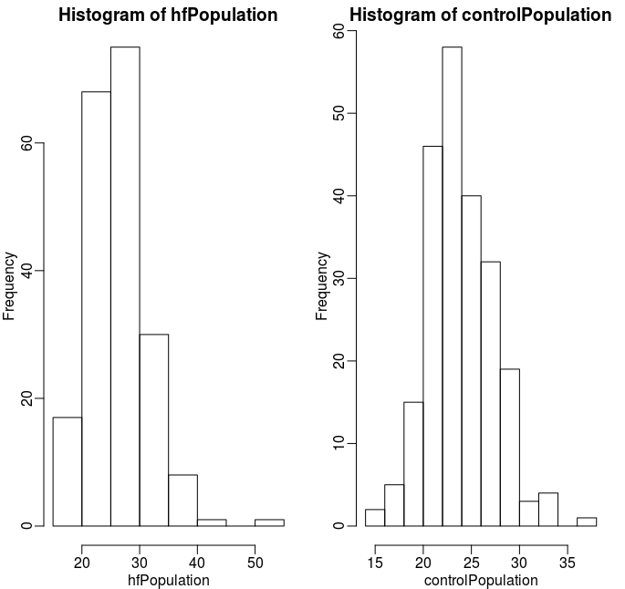
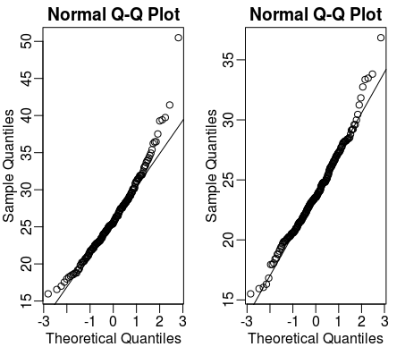
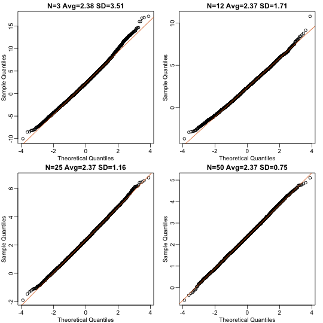
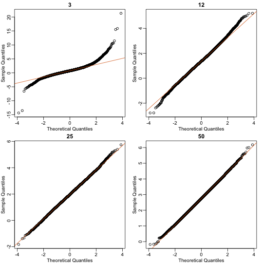
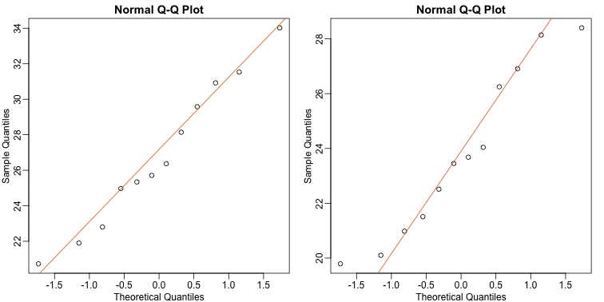

### Havard Univ. PH525x Series - 바이오메디컬 데이터 사이언스

#### CLT (Central Limit Theorem 중심극한정리)

중심극한정리: 모집단의 분포의 상관없이 표본의 크기가 30 이상이면, 표본평균(표본들의 평균)들의 분포가 평균은 <U>모집단의 평균값</U>, 분산은 <U>모집단의 분산/표본의 크기값</U>을 가지는 **정규분포**를 따른다는 이론입니다.

특정한 1000명의 키(신장)의 평균을 조사하려고 했더니 귀찮아서 100명만 뽑아서 평균을 내 보았더니 160이 나왔고, 다음에는 다른 방법으로 뽑아서 구했더니 163이 나왔는데, 이것들을 모두 구한 다음에 평균을 내면 모집단의 평균과 같은 값이 나온다는 의미입니다.

만약, 우리가 모집단으로부터 100개의 샘플을 구해서 평균을 구한 값이 30이 나왔다면, 그 값은 높은 확률로 평균 근처에 있을 가능성이 높다는 것. 표본의 정보를 이용해서 모분산을 추정하고, 표본평균의 신뢰구간 및 오차확률을 구하는 것도 가능.

#### The T-Distribution (T 분포)

T 분포는 1908년 아일랜드 통계학자 윌리엄 고셋에 의해 발견되었는데, 자기의 획기적인 통계 방법을 숨기기 위해 Student라는 필명으로 논문을 발표해서, Student T-분포 라고도 한다고 합니다.

고셋은 기네스 양조 공장에서 일했고, 맥주에 사용되는 보리의 질을 시험하기 위해 이 분포를 도입하였다고 합니다.

자세한 식은 칠판에 필기로..

```R
library(dplyr) ## dplyr 모듈을 로드합니다
## setwd, getwd 를 사용하여 내 데이터를 로드가 가능한 폴더로 이동하게 만들어주기
dat <- read.csv("mice_pheno.csv") #We downloaded this file in a previous section
controlPopulation <- filter(dat,Sex == "F" & Diet == "chow") %>% select(Bodyweight) %>%unlist ## 여자, Chow식으로 다이어트 한 쥐들의 모임
hfPopulation <- filter(dat,Sex == "F" & Diet == "hf") %>% select(Bodyweight) %>% unlist
## 여자, 과체중으로 다이어트 한 쥐들의 모임
```

```R
library(rafalib)
mypar(1,2)
hist(hfPopulation)
hist(controlPopulation)
```
위의 코드는 rafalib 모듈을 로드하여 히스토그램을 만들어주는 명령어 입니다

hfpopulation의 히스토그램과, controlPopulation의 히스토그램을 그리면 이렇습니다



여기서 유의해야 할것은 랜덤변수가 아니라는 것입니다, 데이터에서 존재하는 변수를 뽑아서 하나의 변수에 넣어놓은 변수일 뿐입니다.

그리고 qqplot을 사용하여 데이터가 Normally-Distributed 되어 있는지 확인할 수 있습니다.

만약에 점들이 모여서 선으로 만들어진 것들이 선으로 걸쳐져 있다면, 우리는 Theorical Distribution에 거의 맞다고 볼 수 있습니다, 밑의 명령어는 qqplot을 그리는 명령어 입니다.

```R
mypar(1,2)
qqnorm(hfPopulation)
qqline(hfPopulation)
qqnorm(controlPopulation)
qqline(controlPopulation)
```



### CLT in Practice (Using R) - 중심극한정리를 R을 이용하여 연습해봅시다

```R
dat <- read.csv("mice_pheno.csv") ## 파일을 읽고
head(dat) ## 데이터의 머리쪽을 출력해본 뒤에... 
library(dplyr) ## dplyr모듈을 읽고 
controlPopulation <- filter(dat,Sex == "F" & Diet == "chow") %>% select(Bodyweight) %>% unlist ## ControlPopulation 에다가 여자, Chow식으로 다이어트 한 쥐의 셀에서 BodyWeight 값만 빼서 Numeric 데이터로 바꾸고...
hfPopulation <- filter(dat,Sex == "F" & Diet == "hf") %>% select(Bodyweight) %>% unlist
## hfPopulation 에다가 여자, 과체중 쥐의 셀에서 BodyWeight셀 값만 빼서 Numeric 값으로 변환.
```

그러면 준비는 어느정도 끝났고, 일단 평균값을 구해서 빼보도록 하겠습니다.

```R
mu_hf <- mean(hfPopulation) ## hfPopulation의 평균을 구해본다.
mu_control <- mean(controlPopulation) ## ControlPopulation의 평균을 구해본다.
print(mu_hf - mu_control) ## 답은 2.375517이 나옵니다.
```

```R
x <- controlPopulation 
N <- length(x)
populationvar <- mean((x-mean(x))^2)
identical(var(x), populationvar)
## 답은 FALSE
```

```R
identical(var(x)*(N-1)/N, populationvar) ## populationvar 과 계산한 값을 비교
## 답은 TRUE
```
여기에서는 sd함수나 var함수는 사용하지 않고, rafalib의 popsd나 popvar함수를 사용합니다.

(sd랑 var함수가 뭔지 알아봤더니, 각각 표준편차와 분산에 관한 함수였습니다)

```R
library(rafalib)
sd_hf <- popsd(hfPopulation) ## hfPopulatipn의 표준편차를 구해보고
sd_control <- popsd(controlPopulation) ## controlPopulation의 표준편차를 구해봅니다
```

```R
N <- 12 ## N을 12개로 지정.
hf <- sample(hfPopulation, 12) ## hfPopulation 에서 12개를 랜덤으로 뽑고
control <- sample(controlPopulation, 12) ## controlPopulation에서 12개를 랜덤으로 뽑고
```

중심극한정리에서는 Average Population이 30이 되어야 합니다

하지만 that is just a rule of thumb since the preciseness of the approximation depends on the population distribution. 

그래서 여기에서는 N이라고 하는 표준편차를 구하는 방법에 대하여 알아볼 것입니다, 밑이 코드입니다.

```R
Ns <- c(3,12,25,50) ## Ns라는 변수에다가 3, 12, 25, 50 를 얻고.
B <- 10000 ## 시뮬레이션 횟수를 지정.
res <-  sapply(Ns,function(n) {
  replicate(B,mean(sample(hfPopulation,n))-mean(sample(controlPopulation,n)))
})
## for-loop대신에, replicate 라는 함수를 사용한다.
```
qqplot을 사용하여 얼마나 CLT Approximations가 동작하는지 알아볼 것입니다.

```R
mypar(2,2)
for (i in seq(along=Ns)) {
  titleavg <- signif(mean(res[,i]),3)
  titlesd <- signif(popsd(res[,i]),3)
  title <- paste0("N=",Ns[i]," Avg=",titleavg," SD=",titlesd)
  qqnorm(res[,i],main=title)
  qqline(res[,i],col=2)
}
```

그래서 결과값은 이렇게 나옵니다, 여기에서 N - 표준편차의 값이 얼마나 벌어지는지에 따라서 fitting이 잘 되는지에 대하여 알아볼 수 있습니다.

좀 더 자세히 설명해보자면, 표준편차 30에 근접할 때 잘 피팅이 되는것을 확인할 수 있습니다.



최종적인 코드를 만들어서 표현하면 이렇고

```R
Ns <- c(3,12,25,50)
B <- 10000 #number of simulations
##function to compute a t-stat
computetstat <- function(n) {
  y <- sample(hfPopulation,n)
  x <- sample(controlPopulation,n)
  (mean(y)-mean(x))/sqrt(var(y)/n+var(x)/n)
}
res <-  sapply(Ns,function(n) {
  replicate(B,computetstat(n))
})
mypar(2,2)
for (i in seq(along=Ns)) {
  qqnorm(res[,i],main=Ns[i])
  qqline(res[,i],col=2)
}
```

 

이 사진처럼 N이 3일 경우에 그냥 피팅이 아예 맞지 않는 경우를 볼 수 있고, 점차 30을 향하여 다가갈 때에 피팅이 아주 잘 되는것을 볼 수 있습니다.

### T-Test In Practice (티-테스트 실습)

여기에서는 아까 이야기했던 T-Test에 관하여 실습을 해보도록 합니다.

#### 데이터 준비하기

```R
library(dplyr)
dat <- read.csv("femaleMiceWeights.csv")
control <- filter(dat,Diet=="chow") %>% select(Bodyweight) %>% unlist
treatment <- filter(dat,Diet=="hf") %>% select(Bodyweight) %>% unlist
diff <- mean(treatment) - mean(control)
print(diff)
## [1] 3.020833
```

R에서 sd함수 - Standard Deviation(표준편차)함수를 사용합니다.

$SE(\bar{X}) = \sigma / \sqrt{N}$

저 위의 식이 표준오차에 관한 식인데 저 식을 R 명령으로 구현하면 아래와 같습니다

```R
sd(control)/sqrt(length(control))
## [1] 0.8725323
```

근데 우리는 표준오차의 `diff` 값을 원하지, 그냥 표준오차의 평균값을 원하지 않습니다.

그러므로 이 코드를 넣어서 우리는 표준오차의 `diff`값을 구할 수 있습니다

```R
se <- sqrt( 
  var(treatment)/length(treatment) + 
  var(control)/length(control) 
  )
tstat <- diff/se 
```

이 ratio가 t-statisttic을 이야기합니다, 하지만 Theory 상, mean(treatment)값과 mean(control)값이 normal 함으로, 두개의 normal distributed random variable 는 다시 normal 해집니다.

그래서 CLT가 이야기해주는 것은 Approx. Normal 하다는 이야기를 평균 0과 같이 해주고 있습니다. (귀무가설)

#### T-Distribution in Practice (T-분포 테스트)

```R
library(rafalib) ## rafalib를 임포트...
mypar(1,2)
qqnorm(treatment) ## treatment함수에 있는걸 가져와서 그리기.
qqline(treatment,col=2) ## 선으로 그리고, Colum 값을 +2 씩 증가
qqnorm(control) ## control함수에 있는걸 가져와서 그리기. 
qqline(control,col=2) ## 선으로 그리되, Colum 값을 +2 씩 증가
```

위의 코드와 같이 하면 아래와 같은 결과가 나오게 됩니다



이것을 T-Test를 해보도록 하겠습니다 

```R
t.test(treatment, control) ## 이것만 입력하면 됩니다
```

결과값은 아래와 같습니다

```
## 
## 	Welch Two Sample t-test
## 
## data:  treatment and control
## t = 2.0552, df = 20.236, p-value = 0.053
## alternative hypothesis: true difference in means is not equal to 0
## 95 percent confidence interval:
##  -0.04296563  6.08463229
## sample estimates:
## mean of x mean of y 
##  26.83417  23.81333
```

하지만 `$`사인을 이용하여 `p.value` 값만 볼 수 있습니다

```R
result <- t.test(treatment,control)
result$p.value ## 이렇게요
## [1] 0.05299888
```

### Confidence Intervals (신뢰구간)

신뢰구간이란 모평균의 신뢰성을 가늠하기 위해서 구합니다, 모평균을 구하는 이유는 **모집단의 원소는 일반적으로 매우 크기**때문에, 추정을 하게 됩니다 (랜덤으로 수십번 뽑아서 그 값을 보는것 처럼요..?)

그럼 그 값들 중에서 모평균을 계산할 수 있고, 모평균이 들어가 있을 구간을 발견할 수 있을 것입니다.

#### 모집단의 평균의 신뢰구간

지금부터 우리는 어떻게 하면 관리된 FM쥐의 모집단의 평균을 구해볼 것입니다, 그리고 두개의 그룹의 다른 점을 볼 것입니다. 

처음에는 `mice_pheno.csv`라는 파일을 읽도록 하겠습니다

```R
dat <- read.csv("mice_pheno.csv")
chowPopulation <- dat[dat$Sex=="F" & dat$Diet=="chow",3]
```

모집단의 평균은 다음과 같이 구해볼 수 있습니다

```R
mu_chow <- mean(chowPopulation) 
print(mu_chow) ## 23.89238 
```

모집단의 평균을 구해보았으나, 모든 평균엔 관심이 없습니다, 그러니 우리는 30개씩 랜덤하게 뽑아서 평균을 구해보도록 하겠습니다. 

```R 
N <- 30
chow <- sample(chowPopulation, 30)
print(mean(chow))
## 23.351
```

30개의 랜덤추출 한것을 CLT로 계산해 볼 것입니다, CLT는 chow의 평균이 chowpopulation의 평균을 따르고 있다는 것을 알려주고 있습니다 (follows a normal distribution with mean(chowpopulation))

그리고 표준오차에 대한 예상은

```R
se <- sd(chow)/sqrt(N)
print(se)
## 0.4781652 을 얻을 수 있습니다.
```


