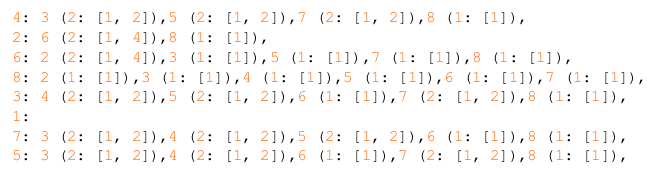

# Chapter 9. Remcommendation Engines Using Mapreduce

### Java code : Author's Github Page, I can't Make it :(

### Cause Java is Too hard =( 

#### I didn't Complete 

1. Customers Who Bought This Item Also Bought (CWBTIAB) 

- Amazon.com's Feature

- They(Book Author, Or I) Will build a simple recommendation System to implement the CWBTIAB Feature 

- Data Type  

	- Amzaon.com's Data

	- Contains User-id and Bought-Item for Each Sale

	- Store Will Suggest Five other items most often bought by buyers of that item
	
	- USER ID , Bought Item 
	
	- Set of Large Transctions : Transaction ID, Data, Price, etc

- Expected Output : Key-Value Pairs

## MapReduce Solution

They Have Two Interactions.

**First** Generate lists & Grouping all items bought by the same user

(By **Hadoop** Framework)

**Second** Solve the co-occurrences problem on list items, They Use the strips

**Input Data Would Be**

| Key     | Value |
|---------|-------|
| (K, K1) | 3     |
| (K, K2) | 2     |
| (K, K3) | 4     |
| (K, K4) | 6     |
| (Z, Z1) | 7     |
| (Z, Z2) | 8     |

**So Output Data Would Be**

| Key | Value                                  |
|-----|----------------------------------------|
| K   | { (k1, 3), (k2, 2), (k3, 4), (k4, 6) } |
| Z   | { (z1, 7), (z2, 8), (z3, 5) }          |

**If Input Like This...**

> K -> { (a, 1), (b, 2), (c, 4), (d, 3) }  
> K -> { (a, 2),         (c, 2)         }  
> K -> { (a, 3), (b, 5),         (d, 5) }   

**Then Output Would be...**

> K -> { (a, 1+2+3), (b, 2+5), (c, 4+2), (d, 3+5) }

**OR**

> K -> { (a, 6), (b, 7), (c, 6), (d, 8) }

**I'll Upload Code ASAP**

## Frequently Bought Together

### Input and Expected Ouput

| Transaction | Purchased Items           |
|-------------|---------------------------|
| T1          | {P1,1, P1,2, ..., P1, k1} |
| T2          | {P2,1, P2,2, ..., P2, k2} |
| ...         | ...                       |
| Tn          | {Pn,1, Pn,2, ..., Pn,kn}  |

- P i,j is in {P1 ~ Pm} 

- Ki is the number of items purchased in transactions Ti

- Each line of input is a transaction ID, followed by a list of products purchased

### Input of FBT Example

| Transaction | Purchased Items |
|-------------|-----------------|
| T1          | {P1, P2, P3}    |
| T2          | {P2, P3}        |
| T3          | {P2, P3, P4}    |
| T4          | {P5, P6}        |
| T5          | {P3, P4}        |

### Desired Ouput of FBT Example 

| Item | Frequently Bought Together |
|------|----------------------------|
| P1   | {P2, P3}                   | 
| P2   | {P1, P3, P4}               | 
| P3   | {P1, P2, P4}               |
| P4   | {P2, P3}                   |
| P5   | {P6}                       | 
| P6   | {P5}                       |

# Mapreduce Solution of FBT 

**Key Value Pairs, It would  be**

    [<p1, p2>, 1]
    [<p1, p3>, 1]
    [<p2, p3>, 1]

**If T1, map() will generate..**

    [<p1, p2>, 1] 
    [<p1, p3>, 1] 
    [<p2, p3>, 1] 

**Then T2, map() will generate..**

    [<p1, p3>, 1]
    [<p1, p2>, 1]
    [<p3, p2>, 1]

**If input is..**

> (S1, S2)  
> (S1, S3)  
> (S1, S4)  
> (S2, S3)  
> (S2, S4)  
> (S3, S4)  

**Then map() will output Like this**

     <Pi, Pj>, N

# I'll Upload This Code ASAP Too

# Friendship Connection

#### Insert Image Here < Friendship Spider Image > On Pg 305

#### INPUT Data

    # hadoop fs -cat /data/friends.txt
    1 1, 2, 3, 4, 5, 6, 7, 8
    2 1, 3, 4, 5, 7
    3 1, 2
    4 1, 2, 6
    5 1, 2
    6 1, 4
    7 1, 2
    8 1
    
#### OutPut Would be... 

    <USER><:><F(M: [I1, I2, I3, ...]), ...>
    
- F is a friend recommended to USER .
- M is the number of mutual friends.
- I1, I2, I3, ... are the IDs of mutual friends.

