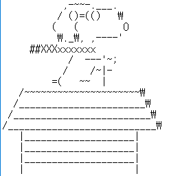

공지! 각 폴더속 파일들이 드문드문 빠져있습니다 시간이 나는대로 틈틈히 추가하여 정리하도록 하겠습니다!

Changed : 2016-07-11 Monday(**월요일**)

SNOOPY! 

# jaeseung172의 깃허브 파일 인덱스

- BigBio 폴더 - 빅바이오라는 스터디그룹에 참여하면서 이것저것 발표한것들을 정리한 폴더입니다, 마크다운과, IPython Notebook 으로 제작하였습니다.

> 간혹가다가 IPynb - 아이파이썬 노트북 파일이 열리지 않는 경우가 있습니다, 그럼 링크를 수정하여 놓도록 하겠습니다.

- Python 폴더 - 파이썬 이것저것 정리한건데 **아직까지 별 볼것 없습니다** 

- install.sh 파일 - Arch Linux 설치할때 편하도록 무려 **한국형** 스크립트를 짜서 만들어놓았습니다, 그리고 mirrorlist.txt 파일은 설치후에 복사하여 붙여넣기 하셔서 적용하시면 됩니다. 이것도 [가이드|예정]()를 만들어볼 예정입니다.

# On StudyLog Folder It Contains...

> Study Boxes for Chemistery, math, BioChemistery. 

> 바이오케미스트리랑 수능준비를 위하여 이것저것 공부한것들을 포함하고 있습니다 (예: 수학, 과학 등등)

### 다음은 제가 이것들을 공부할때 읽었던 책들의 리스트입니다. 

| 책 제목                         | 기간        | 링크 |
|---------------------------------|-------------|------|
| 대학교양과정 생명과학의 이해 - 1    | 2 Weeks Ago | [링크](https://github.com/jaeseung172/Repo/blob/master/Suneng_StudyLog/%EA%B5%90%EC%96%91%EC%9D%98%ED%95%991-Part1.pdf) |
| 모름                            | 모름        |모름  |
